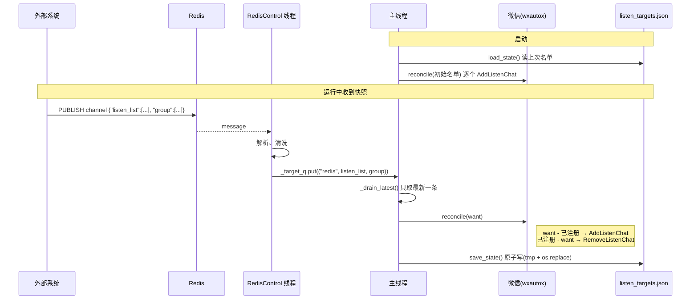
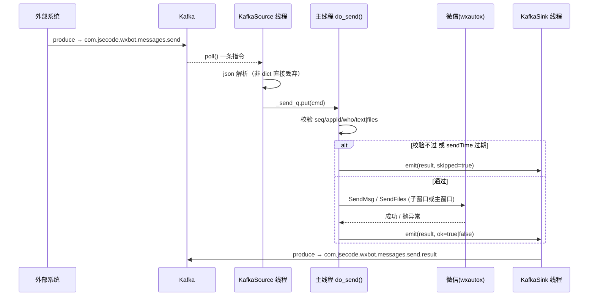

# Kafka / Redis 集成说明

本文档描述 `listen_whitelist.py` 及其配套模块与 **Redis** / **Kafka** 的交互逻辑与流程。
这是本 fork 增加的独立桥接程序，**不属于 `web_server.py` / 面板那套**，两者配置、进程完全隔离。

- 微信收到的消息 → 推 Kafka（入站 topic）
- 外部系统 → Kafka（出站 topic）下发发送指令 → 本程序 `SendMsg` 发微信 → 结果回 Kafka
- 监听哪些联系人/群 → 由 Redis channel 下发「全量快照」动态控制

---

## 1. 组件

| 文件 | 职责 |
|---|---|
| `listen_whitelist.py` | 主程序。连微信、起各线程、**主循环**统一处理监听名单变更与发送指令 |
| `redis_control.py` | `RedisListenControl`：订阅 Redis channel，收到监听名单全量快照 |
| `kafka_sink.py` | `KafkaSink`：一个 Producer 线程，投递「收到的消息」和「发送结果」两类数据 |
| `kafka_source.py` | `KafkaSource`：一个 Consumer 线程，消费「发送指令」 |
| `listen_whitelist.json` | 本程序独立配置（kafka/redis 连接参数）。gitignore；样板 `listen_whitelist.example.json` |
| `listen_targets.json` | 运行时状态文件：最近一次 Redis 快照的落盘副本，重启时据此恢复。gitignore |

依赖：`pip install confluent-kafka redis`（已在 `requirements.txt`）。
**任一库缺失时对应功能自动降级**（KafkaSink 变 dry-run 打印，KafkaSource / RedisControl 直接禁用），主程序不崩。

---

## 2. 线程模型

wxautox4 的 `AddListenChat` / `RemoveListenChat` / `SendMsg` 都是 **UI 自动化 + COM 操作，必须在持有 `WeChat` 对象、且 COM 已初始化的那个线程调用**。因此：

```
┌─────────────────┐   _target_q    ┌──────────────────────────────┐
│ RedisControl 线程│ ─────────────▶ │                              │
│ (订阅 channel)   │  全量快照       │      主线程 main() 循环        │
└─────────────────┘                │                              │
                                   │  - reconcile 监听名单         │
┌─────────────────┐   _send_q      │  - do_send() → wx.SendMsg    │
│ KafkaSource 线程 │ ─────────────▶ │  - _sink.emit(结果)          │
│ (消费 send topic)│  发送指令       │                              │
└─────────────────┘                └───────────┬──────────────────┘
                                               │ _sink.emit(...)
┌─────────────────┐   收到的消息    ┌───────────▼──────────────────┐
│ wxautox 监听回调 │ ─────────────▶ │  KafkaSink 线程 (Producer)    │
│ on_message()    │  _sink.emit()  │  → 入站 topic / 结果 topic    │
└─────────────────┘                └──────────────────────────────┘
```

- Redis / Kafka 消费线程**只解析、只入队**（`queue.Queue`），绝不直接碰 wxautox。
- 主循环每 0.5s：先取最新一条 Redis 快照做 reconcile，再清空发送指令队列逐条 `do_send`。
- `on_message` 回调运行在 wxautox 自己的监听线程池（`WxParam.LISTENER_EXCUTOR_WORKERS`，默认 4），里面只做 `_sink.emit()`（非阻塞、异常不外抛）。
- `KafkaSink` 独占一个 Producer 线程，`emit()` 只往队列塞。

---

## 3. 配置：`listen_whitelist.json`

与脚本同目录（onefile 打包后为 exe 同目录）。启动读一次，改动需重启。缺失的键用脚本内 `DEFAULTS`。

```json
{
    "kafka_brokers":            "kafka.mw.svc.dev.local:9092",
    "kafka_topic":              "com.jsecode.wxbot.messages.receive",
    "kafka_send_topic":         "com.jsecode.wxbot.messages.send",
    "kafka_send_result_topic":  "com.jsecode.wxbot.messages.send.result",
    "kafka_group_id":           "wxbot-sender",
    "send_max_delay_seconds":   7200,
    "redis_url":                "redis://redis.mw.svc.dev.local:6379/0",
    "redis_listen_channel":     "com.jsecode.wxbot.listen.update",
    "redis_password":           ""
}
```

| 键 | 说明 |
|---|---|
| `kafka_brokers` | broker 列表，Producer 和 Consumer 共用 |
| `kafka_topic` | **入站**：微信收到的消息投到这里 |
| `kafka_send_topic` | **出站**：外部下发的发送指令从这里消费 |
| `kafka_send_result_topic` | **出站**：每条发送指令的处理结果投到这里 |
| `kafka_group_id` | Consumer group id（`auto.offset.reset=latest`，重启不重放历史指令） |
| `send_max_delay_seconds` | 发送指令 `sendTime` 距今超过此秒数则不发（仍回结果），默认 7200（2h） |
| `redis_url` | `redis://[:password@]host:port/db`，支持 ACL 用户名写在 url 里 |
| `redis_listen_channel` | 订阅的 pub/sub channel，用于下发监听名单全量快照 |
| `redis_password` | 单独指定密码，**优先于** url 内的密码。启动日志里 url 会脱敏成 `redis://***@...` |

---

## 4. Redis：监听名单的动态控制

### 4.1 机制

监听名单（要监听哪些联系人/群）**不来自任何配置文件**，唯一来源是 Redis channel 下发的**全量快照**。

**channel 消息格式**（JSON，全量，不是增量）：

```json
{"listen_list": ["联系人A", "联系人B"], "group": ["群1", "群2"]}
```

- 缺 `listen_list` / `group` 键按空数组处理；多余的键忽略。
- 元素自动去空白、去空串、去重。
- `listen_list` 与 `group` 合并成一个目标集合（脚本内部不区分二者，都是「要监听的会话名」）。

### 4.2 流程



### 4.3 reconcile（`listen_whitelist.py: reconcile()`）

拿到目标集合 `want` 后：

- `want - registered` 里的：逐个 `wx.AddListenChat(nickname, callback=on_message)`，成功才加进 `registered`，每个之间 `sleep(0.5)`
- `registered - want` 里的：逐个 `wx.RemoveListenChat(nickname)`，从 `registered` 移除，每个之间 `sleep(0.3)`
- `AddListenChat` 失败（返回假值 / 抛异常，例如错误码 1400「无效窗口句柄」= 昵称在当前微信号里找不到对应会话，或主窗口被最小化）会打印告警并跳过，不影响其它条目

### 4.4 落盘与恢复

- 每次成功处理一条快照后，把该快照原样写入 `listen_targets.json`（`{"listen_list":[...], "group":[...], "updated_at":"..."}`），原子写。
- 启动时 `load_state()` 读它恢复上次名单；文件不存在 → 空跑，等第一条 Redis 快照。
- 该文件 gitignore，不入库。

### 4.5 重连

`RedisControl._run` 外层 `while not stopped`：连接 / 订阅出错 → 打印 → `wait(RECONNECT_DELAY=5s)` → 重连。用 `pubsub.get_message(timeout=1.0)` 轮询而非阻塞 `listen()`，`stop()` 能及时生效。

### 4.6 手动下发

```bash
redis-cli -u redis://redis.mw.svc.dev.local:6379/0 \
  PUBLISH com.jsecode.wxbot.listen.update \
  '{"listen_list":["andy"],"group":["坑","测试群"]}'
```

---

## 5. Kafka 入站：收到的微信消息

**topic**：`kafka_topic`（默认 `com.jsecode.wxbot.messages.receive`）

每当已注册会话收到新消息，wxautox 回调 `on_message(msg, chat)`，其中 `_sink.emit({...})` 投递：

```json
{
  "bot": "小亿",
  "chat": "张三",
  "sender": "张三",
  "attr": "friend",
  "type": "text",
  "content": "你好",
  "msg_id": "……",
  "ts": "2026-09-10T17:00:00"
}
```

| 字段 | 说明 |
|---|---|
| `bot` | 当前登录微信昵称 |
| `chat` | 会话名（`chat.who`）。**作为 Kafka message key**，同一会话进同一分区，保证顺序 |
| `sender` | 发送人昵称 |
| `attr` | `friend`=别人发来 / `self`=自己多端同步发的 / `system`=系统消息。**三种都会投递**，下游自行过滤 |
| `type` | `text` / `image` / `voice` / `quote` / ... 图片、语音的 `content` 可能是本地路径或占位符 |
| `content` | 消息内容 |
| `msg_id` | wxautox 的消息 id，可能为 `null`；下游按此去重 |
| `ts` | 本机收到时间 ISO8601（本地时区，秒级） |

`emit` 非阻塞；若 KafkaSink 队列满（默认 10000）则丢弃并每 100 条打印一次。回调里 emit 抛异常会被捕获打印，不会中断微信监听。

---

## 6. Kafka 出站：发送指令

**topic**：`kafka_send_topic`（默认 `com.jsecode.wxbot.messages.send`）
**消费**：`KafkaSource`，group `kafka_group_id`，`auto.offset.reset=latest`（**重启不重放历史指令**，避免重复发送），`enable.auto.commit=true`。

### 6.1 指令格式

```json
{
  "seq": "123",
  "appId": "crm",
  "who": "张三",
  "sendTime": "2026-09-10T17:00:00+08:00",
  "text": "你好",
  "at": ["李四"],
  "files": ["D:/a.png"]
}
```

| 字段 | 必填 | 说明 |
|---|---|---|
| `seq` | **是** | 消息 id，原样回传到结果 topic，用于对齐请求与结果。number / string 均可 |
| `appId` | **是** | 上游调用方标识，原样回传 |
| `who` | **是** | 联系人或群名，需与微信里显示的会话名完全一致 |
| `text` | 与 `files` 二选一 | 文本内容 |
| `files` | 与 `text` 二选一 | list，图片/文件/视频路径 |
| `at` | 否 | str 或 list，仅群聊有效 |
| `sendTime` | 建议带 | ISO8601（可带 `Z` / `+08:00`）或 epoch 秒 / 毫秒。**不带时区按本机本地时间解释** |

`Z` = UTC（零时区），`2026-09-10T09:00:00Z` ≡ `2026-09-10T17:00:00+08:00`。

### 6.2 校验与过期（`do_send()`）

按顺序：

1. `seq` 空 → 拒绝，`error="missing 'seq'"`
2. `appId` 空 → 拒绝，`error="missing 'appId'"`
3. `who` 空 → 拒绝，`error="missing 'who'"`
4. `text` 和 `files` 都空 → 拒绝，`error="empty: no 'text' or 'files'"`
5. `sendTime` 能解析且 `now - sendTime > send_max_delay_seconds` → 拒绝，`error="stale: delay Ns > Ms"`
   （`sendTime` 缺失或无法解析 → 跳过过期检查，照常发送，仅打印告警）

拒绝时 `result["skipped"] = True`，**不调用 SendMsg**。

### 6.3 发送路由

`who` 在当前监听集 `registered` 里 → `wx.GetSubWindow(nickname=who).SendMsg(...)`（子窗口，`via="subwindow"`）
否则 → `wx.SendMsg(msg=, who=, at=)`（主窗口，`via="mainwindow"`，需要对方在通讯录/最近会话能被搜到）

`files` 用 `SendFiles`，`text` 用 `SendMsg`，两者都给则先发文件再发文本。逐条指令之间 `sleep(0.5)`（被拒绝的不占节流）。

### 6.4 流程



---

## 7. Kafka 出站：发送结果

**topic**：`kafka_send_result_topic`（默认 `com.jsecode.wxbot.messages.send.result`）

**每条发送指令都回一条结果**（包括校验失败、过期）。

```json
{
  "seq": "123",
  "appId": "crm",
  "bot": "小亿",
  "who": "张三",
  "ok": true,
  "skipped": false,
  "error": null,
  "via": "mainwindow",
  "sendTime": "2026-09-10T17:00:00+08:00",
  "delaySeconds": 12.3,
  "ts": "2026-09-10T17:00:12"
}
```

| 字段 | 说明 |
|---|---|
| `seq` / `appId` / `sendTime` | 从指令原样回传 |
| `bot` | 当前登录微信昵称 |
| `who` | 目标会话名 |
| `ok` | 是否真的调用 SendMsg 成功 |
| `skipped` | `true` = 主动没发（校验失败 / 过期）；`false` 且 `ok=false` = 调了 SendMsg 但 wxautox 报错 |
| `error` | 失败/拒绝原因，成功为 `null` |
| `via` | `subwindow` / `mainwindow` / `null`（未发送时） |
| `delaySeconds` | `now - sendTime` 秒数，无法算时为 `null` |
| `ts` | 结果生成时间 ISO8601 |

结果与「收到的消息」共用同一个 `KafkaSink` Producer，通过 `emit(payload, topic=...)` 指定不同 topic。

### 结果矩阵

| 情况 | `skipped` | `ok` | `error` |
|---|---|---|---|
| 发送成功 | false | true | `null` |
| 缺 `seq` / `appId` / `who` | true | false | `missing 'xxx'` |
| `text`、`files` 都空 | true | false | `empty: no 'text' or 'files'` |
| `sendTime` 过期 | true | false | `stale: delay Ns > Ms` |
| 调 SendMsg 抛异常 | false | false | 异常 `repr` |

---

## 8. Kafka Producer / Consumer 参数

**KafkaSink（Producer，`kafka_sink.py`）**

| 参数 | 值 | 目的 |
|---|---|---|
| `enable.idempotence` | `true` | 幂等，配合下游按 `msg_id` / `seq` 去重 |
| `acks` | `all` | |
| `linger.ms` | `50` | 小批量聚合 |
| `compression.type` | `lz4` | |
| `message.timeout.ms` | `120000` | 120s 内投递不成功 → `on_delivery` 回调 error |
| message key | `chat` → `who` → `appId` → `""` | 同会话/同目标进同一分区 |

**KafkaSource（Consumer，`kafka_source.py`）**

| 参数 | 值 | 目的 |
|---|---|---|
| `group.id` | `kafka_group_id` | |
| `auto.offset.reset` | `latest` | **重启只消费新指令，不重放历史**（重放 = 重复发送） |
| `enable.auto.commit` | `true` | at-least-once。极端情况下崩溃重启可能漏一条正在处理的；要更强保证需改为处理后手动 commit |

---

## 9. 启动 / 退出时序

**启动**（`main()`）：

1. `load_config()` 读 `listen_whitelist.json`
2. `load_state()` 读 `listen_targets.json` 得到初始名单
3. `connect_wechat()`，记录 `bot` 昵称
4. `KafkaSink.start()`（Producer 线程）
5. `KafkaSource.start()`（Consumer 线程，订阅 `send` topic）
6. `RedisListenControl.start()`（订阅线程，订阅 channel）
7. `wx.StopListening()` → `sleep(1)` → `wx.StartListening()`
8. `reconcile(初始名单)` 逐个 `AddListenChat`
9. 进入主循环

**退出**（`Ctrl+C`）：`control.stop()` → `source.stop()` → `wx.StopListening()` → `_sink.stop()`（`flush(30)` 尽量发完队列里的）。

---

## 10. 故障排查

**症状：日志打了「指令未发送」，但结果没进 Kafka**

代码路径本身一定会 `emit`，问题在 `emit` 之后：

| 现象 | 结论 / 处理 |
|---|---|
| 启动日志有 `[KafkaSink] 未安装 confluent-kafka` | dry-run 模式，`pip install confluent-kafka` |
| 控制台出现 `[KafkaSink:dryrun] <topic> <- {...}` | 同上，dry-run |
| 出现 `[KafkaSink] 投递失败` / `produce 异常` | 结果 topic 不存在（且 broker 关了 auto-create）或无写权限 → 建 topic / 调 ACL |
| `Ctrl+C` 退出时打 `[KafkaSink] 退出时仍有 N 条未确认` | 在投但确认不了 → topic / 网络问题 |
| 连 dryrun 都没有 | Producer 线程启动即崩（如 `bootstrap.servers` 非法）→ 查启动 stderr traceback |
| 入站消息能进 `.receive`，只有 `.send.result` 没有 | Producer 正常，就是 `.send.result` 这个 topic 的问题 |

**其它**

- `AddListenChat` 报错码 1400「无效窗口句柄」：`who` 在当前微信号里没有对应会话（名称不一致），或微信主窗口被最小化 / 不可见。
- `sendTime` 老是判过期：检查是不是没带时区、两边时区不一致；改用 `+08:00` / `Z` / epoch 毫秒。
- Redis / Kafka 库未装：对应线程直接不启动，日志会说明；主程序其余部分照跑。

---

## 11. 与主项目（`web_server.py` / 面板）的关系

**完全隔离**：

- 本程序读 `listen_whitelist.json`，**不碰 `config/config.json`**（`import wxbot_core` 只为触发它对 wxautox 的 `WxParam` 调优，不实例化 `WXBotConfig`）。
- 独立的进程、独立的微信监听。**不要和 `web_server.py` 启动的机器人同时监听同一个微信号**，会造成 wxautox 监听冲突。
- 状态文件 `listen_targets.json` 与主项目的 `memory/` / `old_wxbot_config/` 无关。
