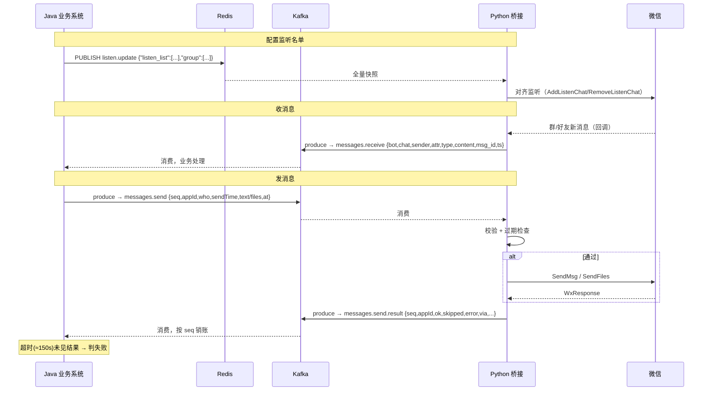

# 微信桥接程序 —— Redis / Kafka 交互需求

> 对接方：Java 业务系统
> 被对接方：`listen_whitelist.py`（Python，运行在装了微信 PC 客户端的 Windows 机器上）
> 通道：Redis pub/sub（控制监听名单）+ Kafka（消息流 / 发送指令 / 发送结果）
> 本文是**接口契约**，Java 侧据此实现；Python 侧行为细节见 `KAFKA_REDIS.md`。

---

## 1. 概述

```
                      Redis channel (全量快照)
   Java 业务系统  ──────────────────────────────▶  Python 桥接程序
       │           com.jsecode.wxbot.listen.update       │
       │                                                  │  控制"监听哪些联系人/群"
       │
       │           Kafka: com.jsecode.wxbot.messages.send   (Java 生产 → Python 消费)
       │  ───────────────────────────────────────────────▶  发送指令
       │
       │           Kafka: com.jsecode.wxbot.messages.receive (Python 生产 → Java 消费)
       │  ◀───────────────────────────────────────────────  微信收到的消息
       │
       │           Kafka: com.jsecode.wxbot.messages.send.result (Python 生产 → Java 消费)
       │  ◀───────────────────────────────────────────────  每条发送指令的处理结果
```

职责边界：

| 事项 | 负责方 |
|---|---|
| 决定监听名单、下发全量快照 | **Java** |
| 实际操作微信（加/removed 监听、SendMsg） | Python |
| 把收到的微信消息转发出来 | Python |
| 消费收到的消息、做业务处理 | Java |
| 生成发送指令 | Java |
| 回报发送结果 | Python |
| 用 `seq` 对齐发送指令与结果、超时兜底 | **Java** |

---

## 2. 通道清单

| 用途 | 类型 | 名称（默认，可配） | 方向 |
|---|---|---|---|
| 监听名单控制 | Redis pub/sub channel | `com.jsecode.wxbot.listen.update` | Java → Python |
| 收到的微信消息 | Kafka topic | `com.jsecode.wxbot.messages.receive` | Python → Java |
| 发送指令 | Kafka topic | `com.jsecode.wxbot.messages.send` | Java → Python |
| 发送结果 | Kafka topic | `com.jsecode.wxbot.messages.send.result` | Python → Java |

- Redis / Kafka 地址由双方各自配置，**topic 名与 channel 名两侧必须一致**。
- Python 侧配置在 `listen_whitelist.json`（键：`redis_url` `redis_listen_channel` `kafka_brokers` `kafka_topic` `kafka_send_topic` `kafka_send_result_topic` `kafka_group_id` `send_max_delay_seconds`）。
- 所有 Kafka 消息 value、Redis 消息体都是 **UTF-8 编码的单个 JSON 对象**，无外层信封 / 分隔符。

---

## 3. Redis：监听名单控制（Java → Python）

### 3.1 语义

- Java 向 channel `PUBLISH` 一条 **全量快照** JSON，Python 收到后把当前监听对象**对齐**到该快照（多退少补）。
- **全量，不是增量**：每次都要发完整的名单。要加一个群，就发「原有全部 + 新群」；要删，就发「去掉它之后的全部」。
- **最后一条生效**：短时间内发多条，Python 只应用最新一条。
- **幂等**：重复发同样的快照没有副作用。
- Python 会把最近一次快照落盘（`listen_targets.json`），**重启后自动恢复**，Java 无需在 Python 重启后重发（但见 3.4）。

### 3.2 消息格式

```json
{"listen_list": ["联系人昵称A", "联系人昵称B"], "group": ["群名称1", "群名称2"]}
```

| 字段 | 必填 | 说明 |
|---|---|---|
| `listen_list` | 否（缺省 `[]`） | 要监听的**联系人**昵称数组 |
| `group` | 否（缺省 `[]`） | 要监听的**群**名称数组 |

- 名字必须与微信里显示的会话名 **完全一致**（含空格、emoji）。
- Python 内部不区分 `listen_list` / `group`，两者合并成一个"要监听的会话名集合"；分开只是给 Java 侧语义清晰。
- 元素自动去空白、去空串、去重。
- 空快照 `{"listen_list":[],"group":[]}` = 取消所有监听。

### 3.3 Java 侧职责

- 维护"当前应监听名单"的权威副本。
- 名单变化时发一条全量快照。
- 不需要 ACK：Python 不回执。是否真的监听上了，只能间接观察（该会话开始有消息进 `receive` topic）。
- Redis 有密码时，Java 用标准 Redis 客户端配置即可。

### 3.4 已知限制

- **Python 无就绪信号 / 心跳**。Java 无法得知 Python 何时上线。
  - 建议：Java 侧定时（如每 5 分钟）重发一次当前全量快照，作为兜底对齐；Python 侧幂等，重复应用无副作用。
- Python 若在 Java 发布快照时不在线，这条快照会丢（pub/sub 不留存）。定时重发可覆盖此情况。

### 3.5 手动联调

```bash
redis-cli -u redis://:PASSWORD@HOST:6379/0 \
  PUBLISH com.jsecode.wxbot.listen.update \
  '{"listen_list":["andy"],"group":["坑","测试群"]}'
```

---

## 4. Kafka：收到的微信消息（Python → Java）

### 4.1 topic 与消费

- topic：`com.jsecode.wxbot.messages.receive`
- **message key**：会话名（发送人所在的会话，群消息即群名，私聊即对方昵称）。同一会话进同一分区，**分区内有序**。
- Java 用自己的 consumer group 消费。offset 策略自定（建议 `earliest` + 手动提交，避免漏消息）。
- Python 侧 Producer：`enable.idempotence=true`、`acks=all`。

### 4.2 消息格式

```json
{
  "bot": "小亿",
  "chat": "坑",
  "sender": "刘琨",
  "attr": "friend",
  "type": "text",
  "content": "你好",
  "msg_id": "3874...",
  "ts": "2026-09-10T17:00:00"
}
```

| 字段 | 类型 | 说明 |
|---|---|---|
| `bot` | string | 桥接程序当前登录的微信昵称 |
| `chat` | string | 会话名（群名 / 私聊对方昵称）。与 message key 相同 |
| `sender` | string | 发送人昵称 |
| `attr` | string | `friend`=别人发来 / `self`=**该微信号自己发的**（多端同步，如手机上发的） / `system`=系统消息（进群/撤回提示等） |
| `type` | string | `text` `image` `voice` `quote` `file` `link` `emotion` `merge` 等 |
| `content` | string | 文本内容；`image`/`voice`/`file` 时可能是**桥接机器上的本地路径**或占位符，Java 侧一般拿不到该文件，按需忽略 |
| `msg_id` | string / null | wxautox 的消息 id，可能为 `null` |
| `ts` | string | 桥接机器**本地时区**收到时间，ISO8601 秒级，无时区后缀 |

### 4.3 Java 侧注意

- **`attr` 过滤**：通常只处理 `attr == "friend"`。`self` 是机器人号自己发的（含 Java 通过本系统发出去的、也含人在手机上手动发的），`system` 是系统提示。
- **去重**：同一条消息理论上只投递一次，但为稳妥建议按 `(chat, sender, msg_id, content)` 或 `(chat, msg_id)` 去重（`msg_id` 可能为 null，需兜底）。
- **顺序**：仅保证同一 `chat` 分区内有序；跨会话不保证。
- `content` 里的本地路径是桥接机器的路径，对 Java 无意义。

---

## 5. Kafka：发送指令（Java → Python）

### 5.1 topic 与生产

- topic：`com.jsecode.wxbot.messages.send`
- Java 作为 Producer 写入。**建议 message key 用 `who`**（同一会话的发送串行，减少乱序）。
- Python 侧 Consumer：group `wxbot-sender`，**`auto.offset.reset=latest`**。

  > ⚠️ **重要**：Python 不在线时 Java 发的指令会被跳过（latest 语义，不补历史）。Java 应：
  > 1. 仅在确认 Python 在线时发指令；或
  > 2. 与 Python 侧约定把 `auto.offset.reset` 改为 `earliest`（需 Python 侧改配置/代码）；
  > 3. 无论如何，靠 §6 的结果超时来发现"没发出去"。

### 5.2 指令格式

```json
{
  "seq": "1697012345001",
  "appId": "crm",
  "who": "坑",
  "sendTime": "2026-09-10T17:00:00+08:00",
  "text": "你好",
  "at": ["刘琨"],
  "files": ["D:/tmp/a.png"]
}
```

| 字段 | 必填 | 类型 | 约束 / 说明 |
|---|---|---|---|
| `seq` | **是** | string / number | **消息 id**。Java 生成，全局唯一，用于对齐结果。原样回传。建议用雪花 id / `时间戳+序号` |
| `appId` | **是** | string | 上游调用方标识。原样回传。多个 Java 服务共用时用于区分来源 |
| `who` | **是** | string | 目标会话名，需与微信里完全一致。**若不在当前监听名单里**，Python 用主窗口搜索发送，需要对方在通讯录 / 最近会话可被搜到 |
| `text` | 与 `files` 二选一（至少一个非空） | string | 文本内容。**不要自己加 `@xxx` 前缀** |
| `files` | 与 `text` 二选一 | string[] | 桥接机器上的**绝对路径**数组（图片/文件/视频）。Java 需保证这些文件在桥接机器可访问（共享盘 / 预先传过去） |
| `at` | 否 | string / string[] | 群 @ 对象。**只写名字，不带 `@` 符号**。名字必须精确等于该成员**在这个群里的显示名**（有群昵称就用群昵称）。对不上时 wxautox 不报错、只是不 @ |
| `sendTime` | 强烈建议 | string / number | 指令产生时间。ISO8601（**建议带时区** `+08:00` 或 `Z`）或 epoch 秒 / 毫秒。距当前超过 `send_max_delay_seconds`（默认 7200 秒 = 2 小时）→ Python **不发送**，回结果 `skipped=true`。不带或无法解析 → 跳过过期检查照常发 |

### 5.3 校验顺序（Python 侧，任一不过即 `skipped=true` 且不发）

1. `seq` 空 → `error="missing 'seq'"`
2. `appId` 空 → `error="missing 'appId'"`
3. `who` 空 → `error="missing 'who'"`
4. `text` 和 `files` 都空 → `error="empty: no 'text' or 'files'"`
5. `sendTime` 可解析且过期 → `error="stale: delay Ns > Ms"`

### 5.4 Java 侧注意

- **幂等**：Python **不做** `seq` 去重。同一 `seq` 发两次 = 微信发两条。Java 必须保证不重复投递（Kafka 生产开幂等 / 事务，或业务层去重）。
- `at` 仅群聊有效，私聊传了会被忽略。
- 多个文件 + 文本：Python 先发文件再发文本。
- 大文本：微信单条有长度限制，超长 Python 不拆分，可能失败或被截断，Java 侧自行分条（多个 `seq`）。

---

## 6. Kafka：发送结果（Python → Java）

### 6.1 topic 与消费

- topic：`com.jsecode.wxbot.messages.send.result`
- **每条发送指令恰好回一条结果**（包括被校验拒绝、被判过期的）。
- **唯一例外**：Python 在处理途中崩溃 → 该指令无结果。Java 必须用**超时**兜底。
- message key：`who`。

### 6.2 结果格式

```json
{
  "seq": "1697012345001",
  "appId": "crm",
  "bot": "小亿",
  "who": "坑",
  "ok": true,
  "skipped": false,
  "error": null,
  "via": "subwindow",
  "resp": {"status": "success", "message": ""},
  "sendTime": "2026-09-10T17:00:00+08:00",
  "delaySeconds": 12.3,
  "ts": "2026-09-10T17:00:12"
}
```

| 字段 | 类型 | 说明 |
|---|---|---|
| `seq` | string / number | 原样回传，**用它对齐请求** |
| `appId` | string | 原样回传 |
| `bot` | string | 桥接程序登录的微信昵称 |
| `who` | string | 目标会话名 |
| `ok` | boolean | **是否发送成功**（取自 wxautox 返回值） |
| `skipped` | boolean | `true` = 主动没发（校验失败 / 过期）；`false` 且 `ok=false` = 调了发送但失败 |
| `error` | string / null | 失败或拒绝原因；成功为 `null` |
| `via` | string / null | `subwindow`（who 在监听名单，用子窗口发）/ `mainwindow`（用主窗口发）/ `null`（未发送） |
| `resp` | object / boolean / null | wxautox 原始返回，排查用，Java 一般不依赖其结构 |
| `sendTime` | 原样回传 | |
| `delaySeconds` | number / null | `now - sendTime` 秒数 |
| `ts` | string | 结果生成时间，桥接机器本地时区 ISO8601 |

### 6.3 结果矩阵

| 情况 | `ok` | `skipped` | `error` | Java 建议动作 |
|---|---|---|---|---|
| 发送成功 | true | false | null | 标记完成 |
| 缺 `seq`/`appId`/`who` | false | true | `missing 'xxx'` | 代码 bug，告警，不重试 |
| `text`/`files` 都空 | false | true | `empty: ...` | 同上 |
| 过期 | false | true | `stale: delay Ns > Ms` | 记录；是否补发由业务决定（补发要新 `seq` + 新 `sendTime`） |
| wxautox 返回失败（@ 不到人 / 切窗失败 / who 不存在等） | false | false | wxautox message | 视 `error` 内容决定：昵称问题→告警人工核对；瞬时问题→可带新 `seq` 重试 |
| 处理中崩溃 | （无结果） | | | **超时**判定失败 |

### 6.4 Java 侧对齐 / 超时

- 发指令时记录 `seq → {发出时间, 业务上下文}`。
- 收到结果按 `seq` 匹配、销账。
- 对每个 `seq` 设超时（建议 **150 秒**：Python 侧 `message.timeout.ms` 120s + 处理余量）。超时未收到结果 → 判为失败，走告警 / 人工 / 谨慎重试（重试必须换新 `seq`）。
- `appId` 可用于多服务隔离：Java 只处理自己 `appId` 的结果。

---

## 7. 端到端时序



---

## 8. 语义总表

| 维度 | 约定 |
|---|---|
| 编码 | 所有消息体 UTF-8 JSON 单对象 |
| 时间 | 结果/消息里的 `ts` 是桥接机器本地时区、无偏移后缀；`sendTime` 建议 Java 侧带时区 |
| Redis 快照 | 全量、幂等、最后一条生效、Python 侧持久化 |
| `receive` 顺序 | 同 `chat` 分区内有序 |
| `receive` 去重 | Python 尽力只投一次；Java 侧仍建议按 `(chat, msg_id)` 去重 |
| `send` 幂等 | **Python 不去重**，Java 必须保证 `seq` 不重复投递 |
| `send` 与 Python 离线 | `auto.offset.reset=latest`，离线期间的指令会丢；靠结果超时发现 |
| `send.result` | 每条指令恰一条结果，崩溃除外；Java 用 `seq` 对齐 + 超时兜底 |
| 重试 | 任何重试都必须用**新的 `seq`** |
| `at` | 只给名字不带 `@`，须等于群内显示名 |
| `files` | 路径是桥接机器上的绝对路径，文件需桥接机器可访问 |

---

## 9. Java 侧实现清单

**Redis**
- [ ] 维护监听名单权威副本，变更时 `PUBLISH` 全量快照
- [ ] 定时（~5min）重发当前快照兜底

**Kafka 消费 `messages.receive`**
- [ ] 独立 consumer group，`earliest` + 手动提交
- [ ] 过滤 `attr`（一般只留 `friend`）
- [ ] 按 `(chat, msg_id)` 去重（`msg_id` 可能 null）

**Kafka 生产 `messages.send`**
- [ ] 生成唯一 `seq`、带 `appId`、带 `sendTime`（含时区）
- [ ] 开启幂等 Producer，`who` 作 key
- [ ] `text` 不加 `@` 前缀；`at` 只给名字
- [ ] `files` 路径对桥接机器可访问

**Kafka 消费 `messages.send.result`**
- [ ] 按 `seq` 对齐、销账
- [ ] 每个 `seq` 设 ~150s 超时，超时判失败
- [ ] 按结果矩阵分类处理（bug / 过期 / 瞬时失败 / 昵称问题）
- [ ] 只处理自己 `appId` 的结果

---

## 10. 联调命令

**下发监听名单**
```bash
redis-cli -u redis://:PASSWORD@HOST:6379/0 \
  PUBLISH com.jsecode.wxbot.listen.update '{"listen_list":["andy"],"group":["坑"]}'
```

**发一条发送指令**
```bash
echo '{"seq":"t-1","appId":"test","who":"坑","sendTime":"'"$(date -Iseconds)"'","text":"联调测试","at":["刘琨"]}' \
| kcat -b HOST:9092 -t com.jsecode.wxbot.messages.send -P
```

**看收到的消息 / 发送结果**
```bash
kcat -b HOST:9092 -t com.jsecode.wxbot.messages.receive -C -o end
kcat -b HOST:9092 -t com.jsecode.wxbot.messages.send.result -C -o end
```

---

## 11. Topic 预创建

Python 侧 Producer 不会自动建 topic（取决于 broker 配置）。上线前请确保以下 topic 已创建：

| topic | 建议分区 | 说明 |
|---|---|---|
| `com.jsecode.wxbot.messages.receive` | 按会话量 | key=会话名，同会话需同分区 |
| `com.jsecode.wxbot.messages.send` | ≥1 | key=who |
| `com.jsecode.wxbot.messages.send.result` | ≥1 | key=who |

若 `messages.send.result` 未创建且 broker 关闭 auto-create，Python 投递结果会在 `message.timeout.ms`（120s）后失败并打印 `[KafkaSink] 投递失败`。
